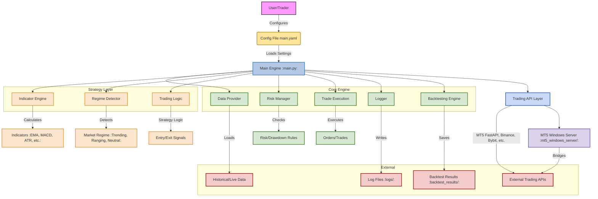

# Algo-Trading-Engine

A modular, backtestable, and live-ready algorithmic trading engine for multi-regime, multi-timeframe strategies. Supports MetaTrader 5 (MT5) via FastAPI bridge, with extensible architecture for new strategies, indicators, and APIs.

---

## Features
 
---

## System Architecture Diagram

Below is a high-level technical design of the trading engine and its components:


- **Dynamic Regime Detection:** Switches between trending and ranging logic using configurable indicators.
- **Multi-Timeframe Support:** Analyze and trade using multiple timeframes (e.g., H1, H4).
- **Backtesting & Live Trading:** Unified engine for both historical and live data.
- **Risk & Drawdown Management:** Advanced controls for risk per trade, drawdown limits, and trade management.
- **Extensible:** Easily add new strategies, indicators, or trading APIs.
- **Comprehensive Logging:** All activity is logged to the `logs/` directory for transparency and debugging.

---

## Project Structure

```
main.py                  # Entry point for backtesting/live trading
config/main.yaml         # Main configuration file (strategy, risk, API, etc.)
requirements.txt         # Python dependencies
src/                     # Core engine, strategies, APIs, utilities
backtest_results/        # Output from backtests (trade history, price data)
logs/                    # Log files for all modules
mt5_windows_server/      # Windows-only FastAPI bridge for MT5 (see below)
```

---

## Setup Instructions

### 1. Clone the Repository
```bash
git clone https://github.com/The-Vheed/Algo-Trading-Engine.git
cd Algo-Trading-Engine
```

### 2. Install Python Dependencies
Ensure you have Python 3.10+ installed.
```bash
pip install -r requirements.txt
```

### 3. Configure the Engine
Edit `config/main.yaml` to customize:
- **Trading API:**
  - `type`: Choose API (e.g., `mt5_fastapi`)
  - `base_url`, `access_key`: Set your API endpoint and credentials
- **Backtesting:**
  - `start`, `end`: Date range for backtest
  - `initial_balance`, `commission_per_lot`, `spread_pips`
  - `output_folder`: Where backtest results are saved
- **Strategy:**
  - `symbols`, `timeframes`, `indicators`, `regime_logic`, `trading_logic`
- **Risk Management:**
  - `risk_per_trade`, `minimum_rrr`, drawdown protection, time filters

> **Tip:** The config file is heavily commented. Uncomment and adjust sections as needed for your use case.

### 4. Run Backtest or Live Trading
- **Backtest:**
  ```bash
  python main.py
  ```
  (Ensure `live: false` in `config/main.yaml`)

- **Live Trading:**
  ```bash
  python main.py
  ```
  (Set `live: true` and configure your trading API)

---

## Viewing Logs
All logs are written to the `logs/` directory, with separate files for each module (e.g., `src.core.data_provider.log`, `src.core.trading_logic.log`).

- **To view logs in real time:**
  ```bash
  tail -f logs/src.core.trading_logic.log
  ```
- **To inspect errors or debug:**
  Open the relevant log file in your editor or use `grep`/`less`.

---

## Customizing the Configuration
- **Strategy Logic:**
  - Add/remove indicators or change their parameters under `strategy.indicators`.
  - Adjust regime detection rules in `strategy.regime_logic`.
  - Modify entry/exit conditions for each regime in `strategy.trading_logic`.
- **Risk & Trade Management:**
  - Tune risk per trade, reward/risk ratios, and drawdown protection in `risk_management`.
- **Time Filters:**
  - Enable/disable trading sessions to avoid low-liquidity periods.

> **See `config/main.yaml` for detailed comments and examples.**

---

## MT5 Windows Server (FastAPI Bridge)
To use the MT5 FastAPI bridge (for live trading with MetaTrader 5):
- See detailed setup and usage instructions in [`mt5_windows_server/README.md`](mt5_windows_server/README.md).
- This component must be run on a Windows machine with MetaTrader 5 installed.
- Configure the `base_url` and `access_key` in your `config/main.yaml` to match the server settings.

---

## Support & Contribution
- **Issues:** Please open issues for bugs or feature requests.
- **Contributions:** PRs are welcome! See code structure in `src/` for where to add new features.

---

## License
This project is licensed under the MIT License.
